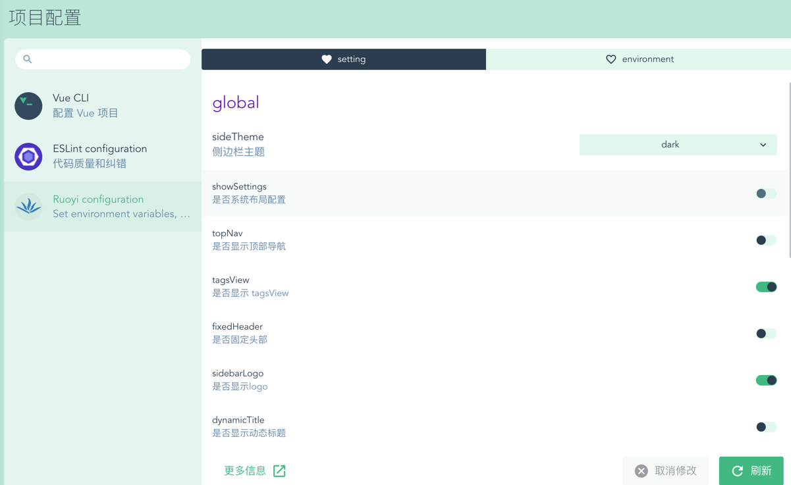
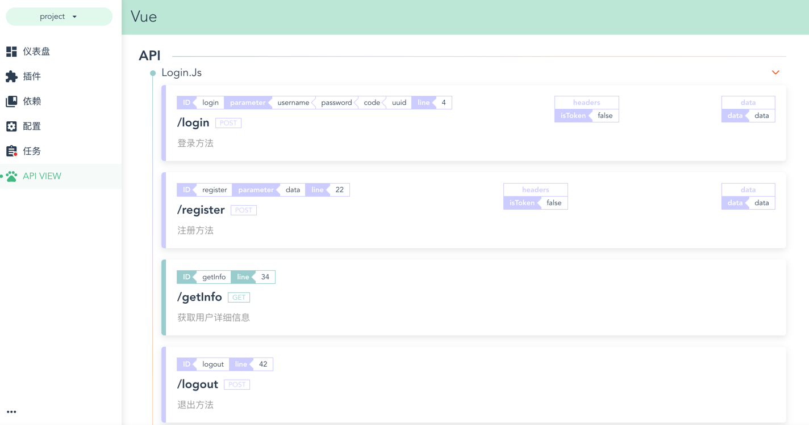
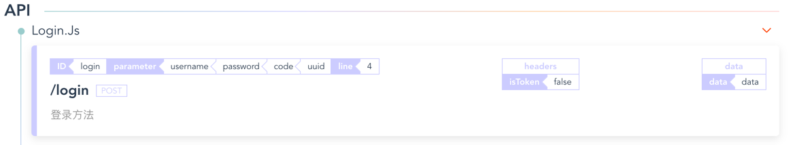

<p align="center">
  <a href="https://github.com/srhinee/block-analysis-webpack-plugin.git">
    
  </a>
</p>

<h3 align="center">vue-cli-plugin-ruoyi</h3>
  <p align="center">
    一个vue-cli插件,用于动态生成ruoyi-vue项目,集成了若依前端项目的配置和api面板.
  </p>


## 目录
- [演示](#演示)
- [开始使用](#开始使用)
- [介绍](#介绍)
- [致谢](#致谢)

## 演示

### 若依配置界面



### 若依API视图



## 开始使用

### 从零新建项目

```shell
vue create --preset shrinee/vue-cli-plugin-ruoyi {project_name}
```

### 从已创建项目开始

:bangbang:**安装插件后会根据若依模板重新覆盖项目文件!!!**

#### 下载插件

```shell
# NPM
npm install --save-dev vue-cli-plugin-ruoyi
# Yarn
yarn add -D vue-cli-plugin-ruoyi
```

#### 命令行安装

```shell
vue add vue-cli-plugin-ruoyi
```

#### UI安装

`vue ui`开启vue-cli面板,进入项目控制台,搜索`vue-cli-plugin-ruoyi`安装即可

## 介绍

### 生成代码

插件在安装时会调用generator api来生成若依项目的前端代码,免去每次手动拉取若依仓库创建项目,并且在项目生成时对项目代码做一些定制化设定,生成代码时会有以下选项:

关于若依的介绍见[详情](https://github.com/yangzongzhuan/RuoYi-Vue/tree/master)
- 是否可以通过点击 modal 关闭 Dialog? 默认为true,选择false则若依项目的所有模态框只能通过关闭按钮来关闭
- 是否添加表单模板? 默认false,用于生成中台通用增删改查表单根组件.

### 若依配置界面

#### setting tab

- global group,对应`src/setting.js`下的配置,若依的一些全局设置.
- proxy group,对应`vue.js.config`下的`devServer`配置,对应dev环境下本地代理服务器的选项.

#### environment tab

- development group,对应`.env.development`环境配置文件.
- production group,对应`.env.production`环境配置文件.
- staging group,对应`.env.staging`环境配置文件.

### API VIEW

这里展示了若依项目下`api`文件夹下所有的请求文件信息,类似于`swagger-ui`,可以在这里速览你项目中的请求信息,对有大量接口的项目来说比较有用.

如`src/api/login.js`中有如下代码:
```js
// 登录方法
export function login(username, password, code, uuid) {
  const data = {
    username,
    password,
    code,
    uuid
  }
  return request({
    url: '/login',
    headers: {
      isToken: false
    },
    method: 'post',
    data: data
  })
}
```
:point_down:是此接口信息的界面

以下是一些字段解释:
- ID 该方法函数名
- parameter 方法接收的参数
- line 方法在文件中起始行数
- headers 请求头携带字段
- data 请求body体携带数据
- params 请求url携带数据

## 致谢
- [vue-cli](https://github.com/vuejs/vue-cli)
- [ruoyi-vue](https://github.com/yangzongzhuan/RuoYi-Vue)
